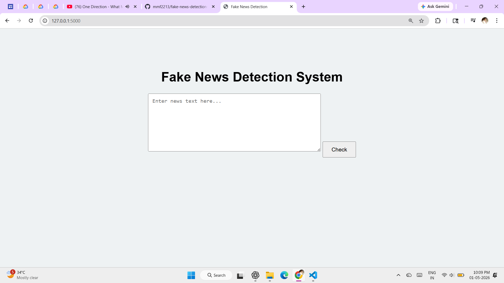
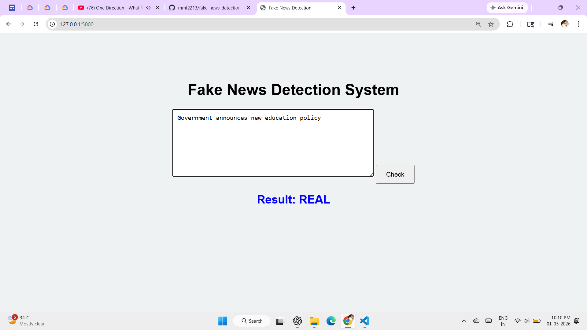
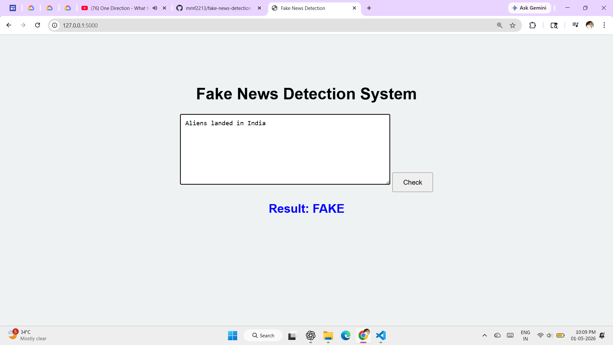

# 📰 Fake News Detection Web Application (Flask + Machine Learning)


---

## 📌 Project Description
This project is a web-based Fake News Detection system that classifies news articles as Real or Fake using Machine Learning and NLP techniques. It also provides a Flask-based web interface for real-time prediction.

---

## 🎯 Objective
- To identify fake and real news articles  
- To apply text preprocessing and feature extraction  
- To build a classification model using Machine Learning  
- To deploy the model using a Flask web application  

---

## 🛠️ Technologies Used
- Python  
- Flask  
- Pandas  
- Scikit-learn  
- Matplotlib  
- NLP (TF-IDF)  

---

## 📂 Project Structure

```
fake-news-detection/
│
├── data/
│   └── news.csv
│
├── src/
│   ├── preprocessing.py
│   ├── model.py
│   └── visualization.py
│
├── static/
│   ├── style.css
│   └── screenshots/
│       ├── fake.png
│       ├── real.png
│       └── ui.png
│
├── templates/
│   └── index.html
│
├── app.py
├── requirements.txt
└── README.md
```

---

## ⚙️ How to Run the Project

### Step 1: Clone the Repository
```
git clone https://github.com/mmf2213/fake-news-detection-web-app.git
cd fake-news-detection-web-app
```

### Step 2: Install Dependencies
```
pip install -r requirements.txt
```

👉 If Flask is missing:
```
pip install flask
```

### Step 3: Run the Application
```
python app.py
```

### Step 4: Open in Browser
```
http://127.0.0.1:5000
```

---

## 📸 Output Screenshots

### 🟢 Web Interface


### 🟡 Real News Prediction


### 🔴 Fake News Prediction


---

## 📊 Output
- Classified news as Real or Fake  
- Confidence score for prediction  
- Visualization of dataset distribution  
- Web-based prediction interface  

---

## 📈 Features
- Text preprocessing (cleaning + stopword removal)  
- TF-IDF feature extraction  
- Logistic Regression classification  
- Flask web interface for real-time prediction  
- Simple and interactive UI  

---

## 🤖 Algorithm Used
- TF-IDF (Term Frequency - Inverse Document Frequency)  
- Logistic Regression  

---

## 🚀 Future Scope
- Use large real-world datasets  
- Improve accuracy using Deep Learning (LSTM/BERT)  
- Integrate real-time news APIs  
- Deploy on cloud (Render / AWS / Heroku)  

---

## 👨‍💻 Author
**Mrunal Fattepurkar**
